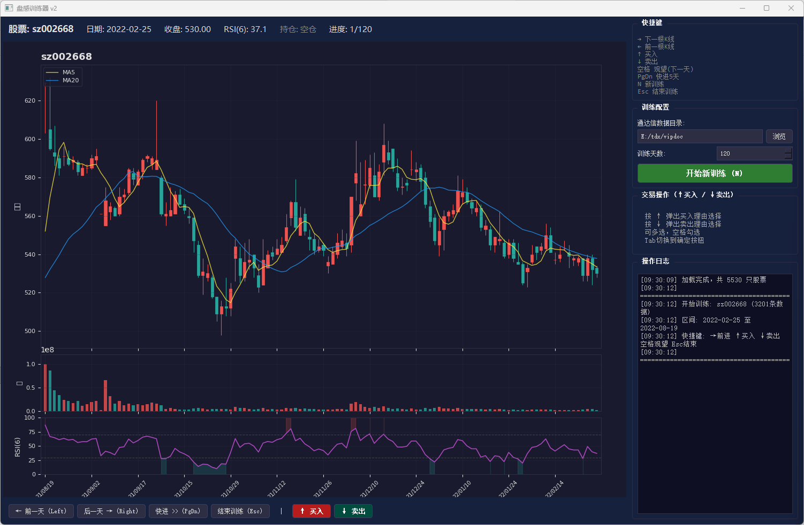

# 盘感训练器

基于通达信本地数据的股票盘感训练工具。

## 功能特点

- 读取通达信本地K线数据
- 随机选股+随机起点
- 固定120根K线窗口，自动滑动（通达信风格）
- K线+成交量+RSI(6)+MA5/MA20
- 训练买卖决策，记录操作理由
- 所有训练记录保存到一个JSON文件，便于AI分析

## 安装依赖

```bash
pip install PyQt5 matplotlib pyyaml numpy
```

## 使用方法

1. 修改 `config.yaml` 中的通达信数据目录
2. 运行程序：`python run.py`

## 快捷键

| 按键 | 功能 |
|------|------|
| → | 下一根K线 |
| ← | 前一根K线 |
| ↑ | 买入 |
| ↓ | 卖出 |
| 空格 | 观望（下一天） |
| PageDown | 快进5天 |
| N | 新训练 |
| Esc | 结束训练 |

## 配置说明

编辑 `config.yaml`：

```yaml
tongdaxin_dir: "D:/通达信/vipdoc"
train_days: 60
rsi_period: 6
buy_reasons: [...]
sell_reasons: [...]
```

## 训练记录

所有记录保存在 `records/all_training_records.json`，直接交给AI分析即可。
